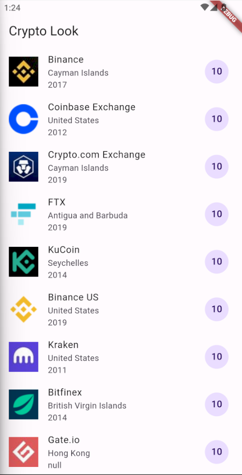
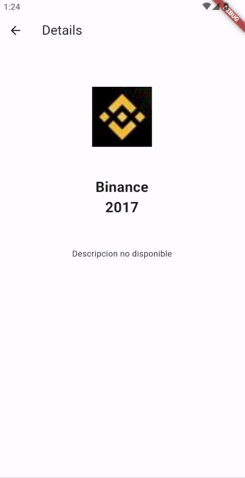
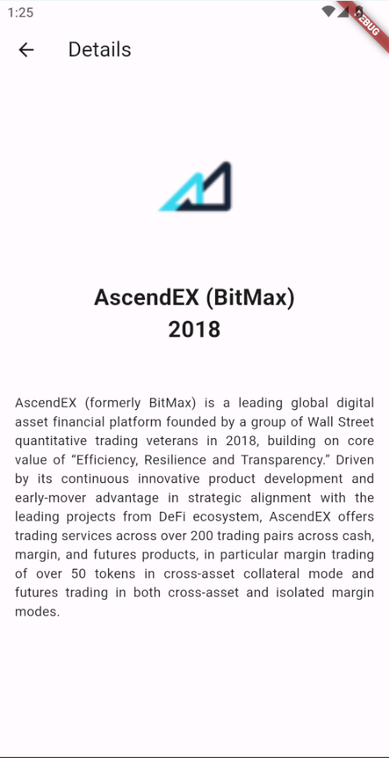

# Alineaciones y estilos

- La pantalla principalmente se construyo con una ListView Builder, donde se puede observar el icono, asi como el nombre, el lugar, su fecha de creacion, y una puntuacion

## Lo que me costo mas trabajo
Me costo mucho trabajo el tema de pasar parametros a la siguiente pagina, ya que era algo que no recordaba pero con ayuda del profe pude resolverlo facilmente

## Lo que aprendi
Creo que lo mas importante que aprendi fue el como recolectar datos de uun archivo a parte, como leerlos, y poder utilizar el ListView Builder para poder mostrar cada uno de ellos

## descripcion de la app
Una app donde te aparecen varias Crytos, en estas puedes picarle a la que sea, lo cual te llevara a una pagina donde tendras detalles de esta

## Referencias
En este caso no use referencias ya que se estuvo realizando en clase con el profesor, la details page salio por puro conocimiento anterior

## Imagenes

