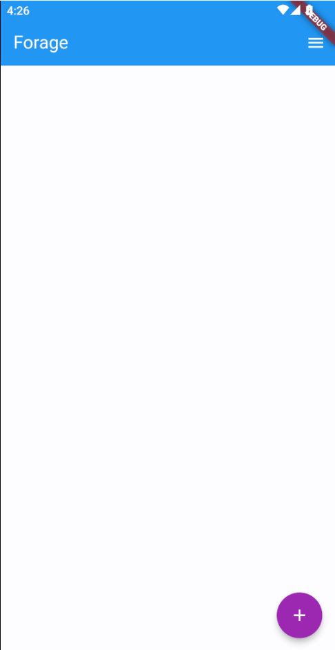
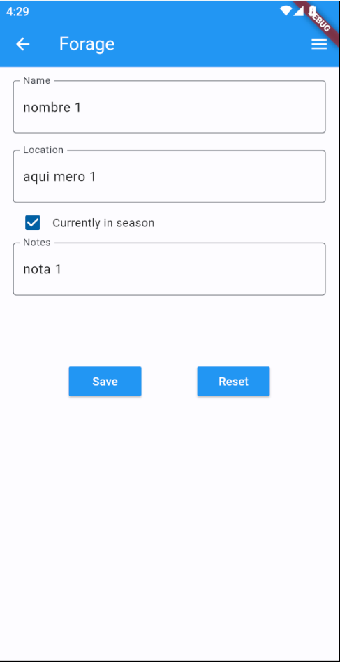
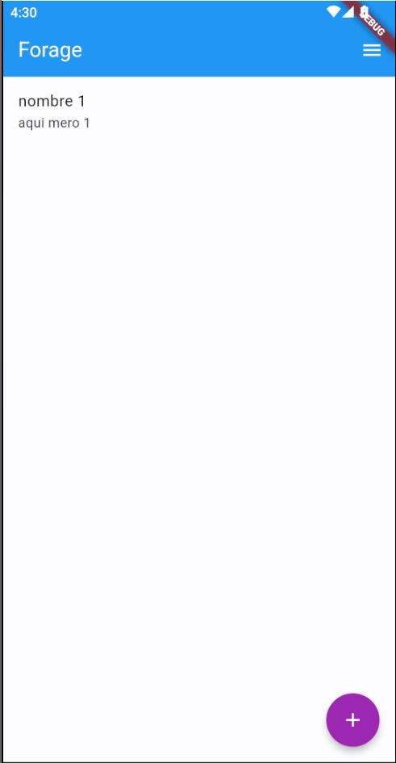
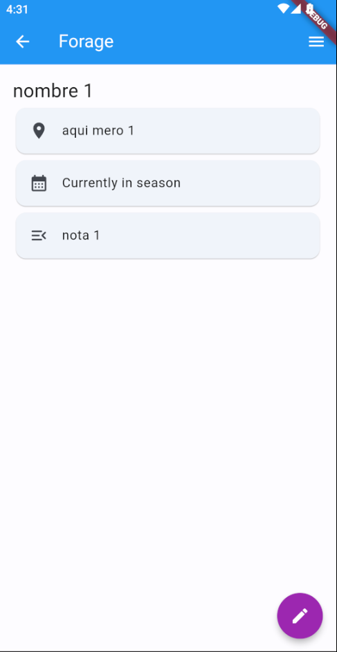

# Tarea 5 | Forage App

## Lo que me costo mas trabajo
Me costo mucho trabajo recordar las cosas, como el como usar providers, como ponerlo en el main, que encierre el MyApp, esos pasos que se configuran al principio

## Lo que aprendi
Aprendi a usar los providers, viendo que tan utilez son mas que nada

## descripcion de la app
La neta no se bien de que es la app, pero puedes agregar varias cosas, y a esas cosas las puedes seleccionar y ver en details

## Referencias
En este caso no use referencias ya que se estuvo realizando en clase con el profesor, la details page salio por puro conocimiento anterior

## Link a video
https://drive.google.com/file/d/19u_o3tINNlGFTtD8GUtWvR0UicDYfe9g/view?usp=sharing 

## Imagenes

