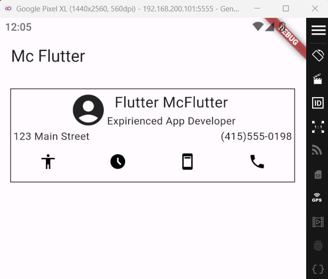
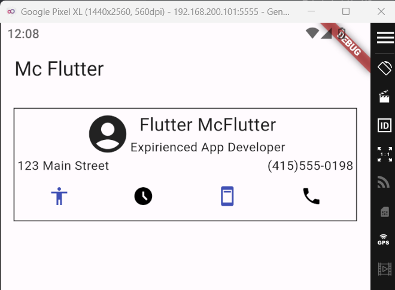
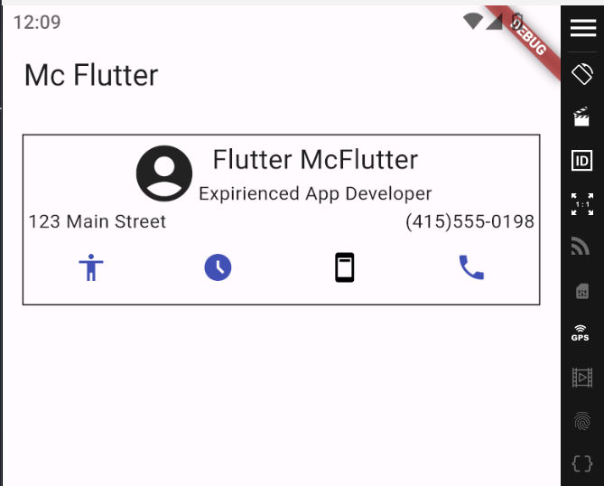

# Mc Flutter

Conociendo los Scaffold y widgets mas comunes

## Lo que me costo mas trabajo
Me costo mucho trabajo hacer funcionar los botones que cambian de color, ya que pues no tenia nada de conocimiento sobre esto y pues sigo sin tener, no entiendo porque tuve que crear como otra clase que no tuviera el StatelessWidget, o solo poderle cambiar el stateless a ful

## Lo que aprendi
Mucho sobre el layout y sobre los max size y todo eso, tambien como ponerle estilos, no puedo decir lo de los estados ya que siento que hace falta una clase sobre eso

## descripcion de la app
Puedes picarle a los iconos de abajo, y estos van a cambiar de color.

Imagenes de la app por si no se ven
https://drive.google.com/drive/folders/178mCc22cSqt5Pc4dnkVHM4xCjHW1Vp0L?usp=drive_link 

## Referencias
How can I add a border to a widget in Flutter? (s. f.). Stack Overflow. https://stackoverflow.com/questions/47423297/how-can-i-add-a-border-to-a-widget-in-flutter

How to change color of IconButton after pressed in flutter. (s. f.). Stack Overflow. https://stackoverflow.com/questions/55091272/how-to-change-color-of-iconbutton-after-pressed-in-flutter

CreateState Method - StatefulWidget Class - Widgets Library - DART API. (s. f.). https://api.flutter.dev/flutter/widgets/StatefulWidget/createState.html 

IconButton Class - Material Library - DART API. (s. f.). https://api.flutter.dev/flutter/material/IconButton-class.html

