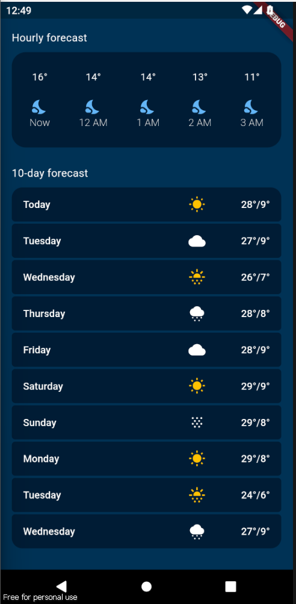
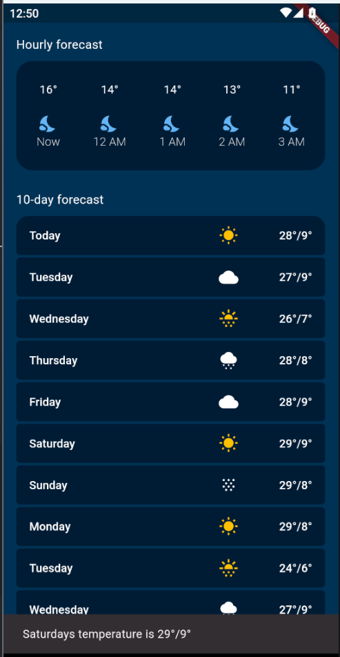
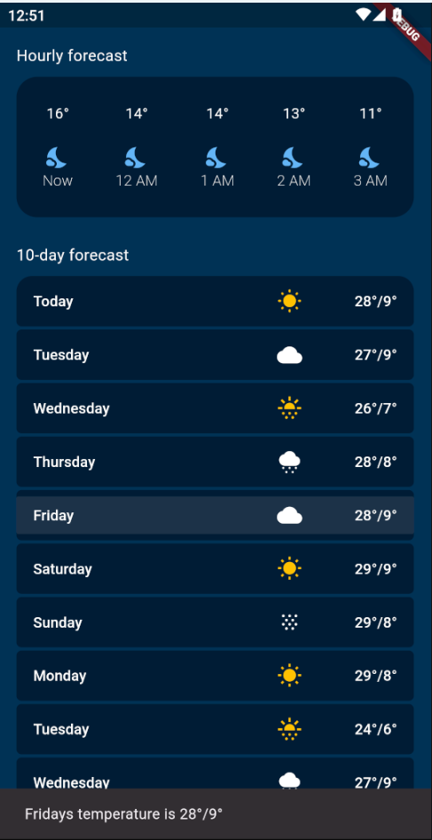

# Analizando layouts

- La pantalla principalmente se construyo como tipo de uun grid, utilizando mucho los containers para poder darle el color que se desea
- Se siguen viendo los temas de layout, ya que es la parte del curso donde tenemos que aprender el front

## Lo que me costo mas trabajo
Me costo mucho esta parte de que en los 10-day forecast, que cuando escribias un dia muy largo, todo se movia, pero ya viendo en clase el widget de expanded pues lo soluciono

## Lo que aprendi
Mucho sobre el layout y sobre los estilos que existen, en especial en los containers, igual creo que urge o hace falta una clase para poder crear un widget y asi poder utilizarlo varias veces para no tener un codigo de 600 lineas de codigo.

## descripcion de la app
Aplicacion del clima que te a la hora de darlee click a cualquier card de los del 10day forecast, te muestra un snackbar con el dia y el clima de ese dia

## Link a video

## Referencias
Flutter give container rounded border. (s. f.). Stack Overflow. https://stackoverflow.com/questions/57777737/flutter-give-container-rounded-border

Educative. (s. f.). Educative Answers - trusted answers to developer questions. https://www.educative.io/answers/how-to-set-the-background-in-flutter

MaterialButton Class - Material Library - DART API. (s. f.). https://api.flutter.dev/flutter/material/MaterialButton-class.html

## Imagenes

