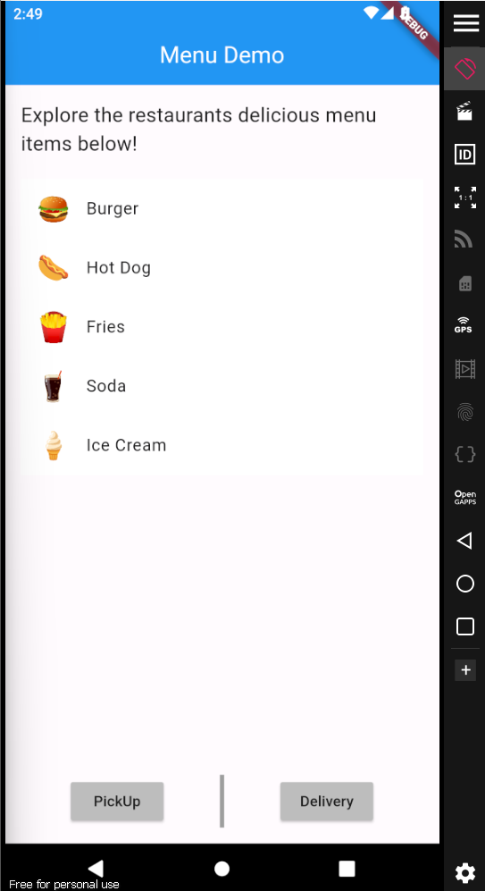
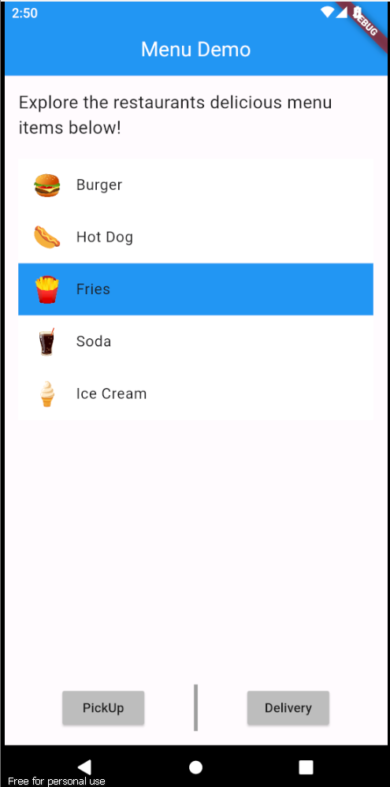
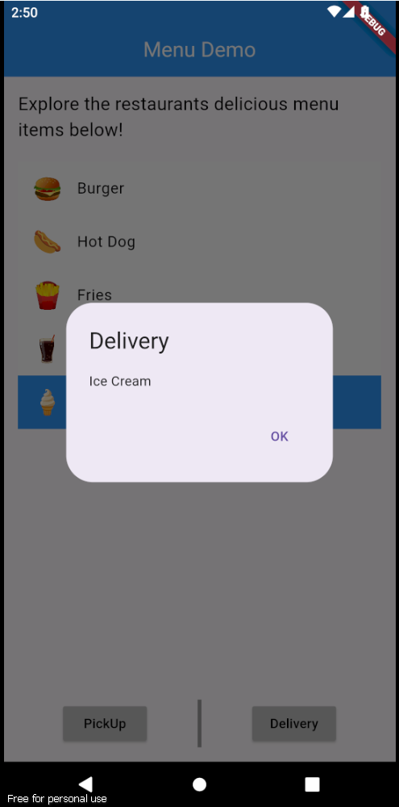
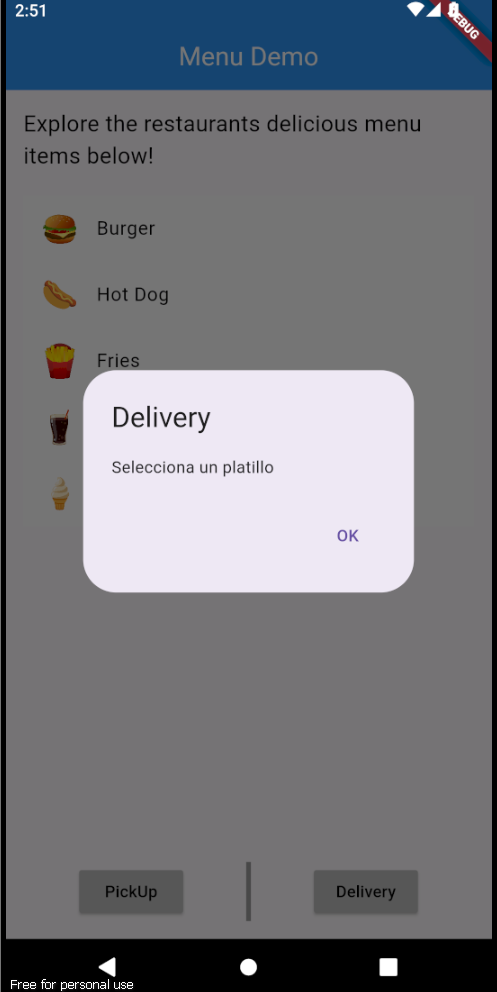
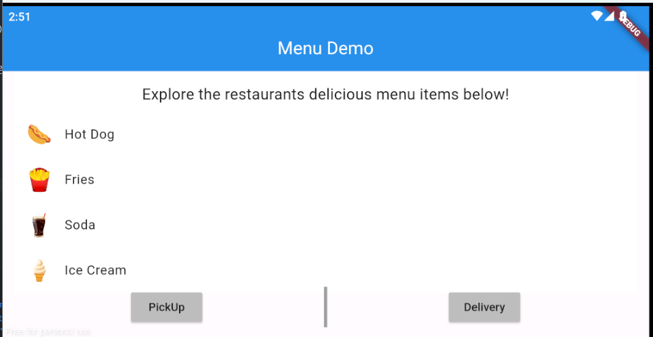

# Alineaciones y estilos

- Checar video para ver todo lo que pide la tarea, como el solo seleccionar un listTile, los botones funcionales y como rota el celular

- La pantalla principalmente se construyo con una columna, donde se tiene el texto, el listview y una row con los botones y el invisible Vertical Divider
- Se siguen viendo los temas de layout, y ahorita principalmente se vio lo de las Listas y tambien cambio de estados

## Lo que me costo mas trabajo
Me costo mucho la parte de la lista, ya que queria implementarla como visto en clase pero me aparecia un error por no poner el expanded, y tambien todo sobre los assets

## Lo que aprendi
Mucho sobre el layout y sobre los estilos que existen, tambien sobre lo de la listview builder, el cual ayudo que no sean muchas lineas de codigo

## descripcion de la app
Un menu demo donde puedes seleccionar solo una bebida/comida, y con 2 botones que sacan una alert diciendo el nombre del producto seleccionado

## Link a video
https://drive.google.com/file/d/140XbX1CTv6at5Wkmx_vyVOknviVLmHUh/view?usp=sharing

## Referencias
GeeksforGeeks. (2022, 10 noviembre). Flutter TextOverFlow. https://www.geeksforgeeks.org/flutter-textoverflow/ 

Change background color of ListTile upon selection in Flutter. (s. f.). Stack Overflow. https://stackoverflow.com/questions/49331612/change-background-color-of-listtile-upon-selection-in-flutter#:~:text=Unfortunately%2C%20ListTile%20doesn't%20have,separate%20the%20same%20colored%20ListTiles.

AlertDialog class - material library - Dart API. (s. f.). https://api.flutter.dev/flutter/material/AlertDialog-class.html

Image.asset constructor - Image - widgets library - Dart API. (s. f.). https://api.flutter.dev/flutter/widgets/Image/Image.asset.html

GeeksforGeeks. (2022a, junio 3). Flutter Asset Image. https://www.geeksforgeeks.org/how-to-add-images-in-flutter-app/

## Imagenes

